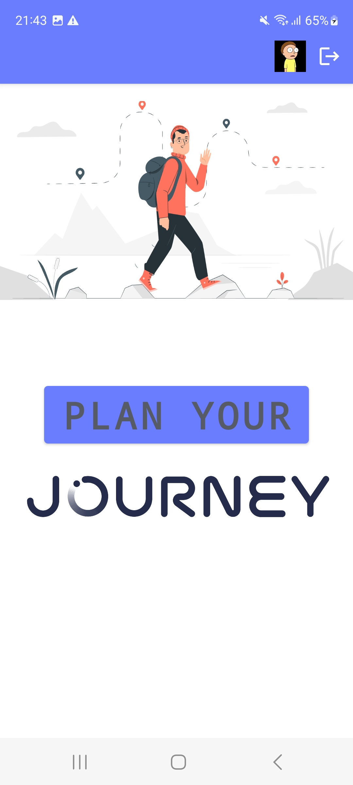
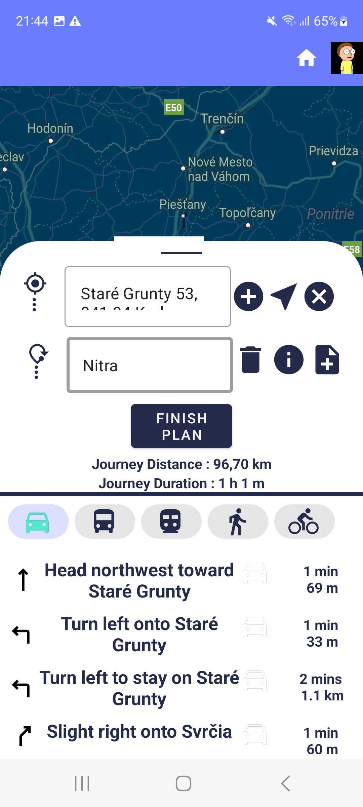

# Dokumentácia Journey aplikácie
---
> ## *O aplikácii:*
> ###### Autor: Bc. Lukáš Lobl
> ### Základné informácie:
> - **Aplikácia slúži na plánovanie výletov, trás rôznymi dopravnými prostriedkami,
> ktoré môžu byť rôzne spájané**
> - **Umožňuje prezerať rôzne miesta, informácie o mieste, pridávanie poznámok a informácií
> o rezervácii miesta**
> - **Umožňuje zdieľať vytvorenú trasu prostredníctvom e-mailu a iných**
> - **Možnosť nájdenia a požiadania o sledovanie  priateľov, alebo iných ľudí**
> - **Po potvrdení sledovania používateľ môže prezerať profil a vytvorené výletý sledovaného používateľa**
> 
> ###### Aplikácia bola vytvorená v rámci zadania diplomovej práce
> ---

# Prihlásenie do aplikácie
---
> - **Registrácia a prihlásenie používateľa pomocou Google účtu**
> 

>
> - **Vyberiete si svoj účet**
> 

>
> - **Po úspešnej autentifikácii sa Vám zobrazí úvodná obrazovka**
> - **Kliknutím na tlačidlo Plan your sa Vám zobrazí mapa s časťou plánovania**

>

# Plánovanie výletu a prezeranie najbližších miest
---
> - **V časti plánovanie si môžete zmeniť svoju polohu pomocou vyhľadávania**
> - **Svoju polohu môžete zmeniť aj cez input, v ktorom je vypísana Vaša poloha**

>
> **Kliknutím na ikonku zobrazíte najbližšie hotely, čerpacie stanice atď**
>

>
> - **Kliknutím na ikonku šípky začnete plánovať svôj výlet**
>

>
> - Kliknutím na ikonku polohy sa Vám opäť nastaví vaša pôvodná poloha
>

# Pridávanie destinácií
---
> - **Kliknutím na ikonku plus si pridáte input na vyhľadanie destinácie**
>

>
> - **Potiahnutím hore si môžete prezrieť navigačné kroky**
>

>
> - **Kliknutim na ikonku dopravného prostriedku zmeníte dopravný prostriedok**
>

>

# Detailné zobrazenie miesta
---
> - **Kliknutím na ikonku informácií sa Vám zobrazia detailnejšie informácie o mieste**
>
 
>

# Pridanie poznámok
---
> - **Kliknutím na ikonku poznámky si môžete pridať poznámku k destinácii**
>
 
>
> - **Zaškrtnutím checkboxu reservation, si môžete pridať informáciu o rezervácii k danému miestu**
>

>

# Uloženie výletu
---
> - **Kliknutím na tlačidlo Finish plan si vytvorený výlet, cestu, trasu môžete pomenovať**
>
 
>
> - **Kliknutím na tlačidlo confirm si daný výlet uložíte**
> - Následne Vás presmeruje do profilu
>

# Zdieľanie výletu
---
> #### V profile môžete vidieť celkové štatistiky Vašich vytvorených výletov
> #### Môžete si výlety spätne prezerať a zdieľať
> - **Kliknutím na tlačidlo Share môžete svôj výlet zazdieľať**
>
 

>
> #### Zobrazenie zdieľaného výletu v maili

>
> - **Kliknutím na link sa Vám zobrazí možnosť otvoriť aplikáciu a zobraziť výlet**
>

>

# Odstránenie výletu
---
> ##### V časti profil
> - Potiahnutím doľava alebo doprava sa Vám zobrazí červené tlačidlo na vymazanie spolu s dialogovým oknom

# Spätné prezeranie výletov
---
> - **Kliknutím na tlačidlo Show si vytvorený výlet zobrazíte**
>

>

# Vyhľadanie používateľov
---
> - **Kliknite na ikonku používateľov v doľnej časti profilu (navigácie)**
> - **Následne napísanim do vyhľadávania sa Vám zobrazia používatelia s obsahujúcimi písmenami, ktoré ste napísali**
>

>
> - Kliknutím na tlačidlo follow odošlete žiadosť o sledovanie daného používateľa
>

# Potvrdenie žiadosti o sledovanie
---
> - **Kliknite na ikonku notifikácie v spodnej časti navigácie v profile, v tejto časti sa Vám zobrazia všetky aktuálne žiadosti inak, je prázdna obrazovka
>

>

# Sledovaný používateľa
---
> - **V rovnakej časti ako vyhľadávanie používateľov sa Vám zobrazia sledovaný používatelia**
>

>

# Prezeranie profilu sledovaných používateľov
---
> - **Kliknutím na profilovku používateľa sa Vám zobrazí profil používateľa spolu s jeho výletmi**
>

>
> - Kliknutím na šípku sa vrátite späť do profilu
>
# Zobrazenie výletu používateľa
---
> - **Kliknutím na tlačidlo Show sa Vám zobrazí daný výlet používateľa**
>

>
